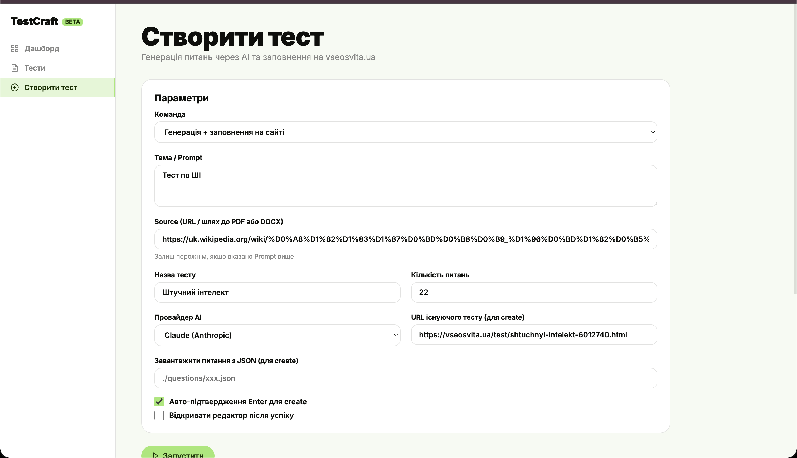

# TestCraft — autoTestScreen

Автоматична генерація тестів для [vseosvita.ua](https://vseosvita.ua) через AI + Playwright.  
Вказуєш тему або джерело (URL / PDF / DOCX) — скрипт генерує питання і автоматично заповнює конструктор тестів на сайті.



---

## Що таке Node.js і npm — коротко

> Якщо ти вже знаєш — пропускай цей розділ.

**Node.js** — це середовище, яке дозволяє запускати JavaScript поза браузером: на твоєму комп'ютері, на сервері.  
Думай про нього як про «двигун» — без нього `.js` файли просто не запустяться.

**npm** (Node Package Manager) — менеджер пакетів, який іде разом з Node.js.  
Це як AppStore для бібліотек коду. Команда `npm install` читає файл `package.json` і завантажує всі залежності в папку `node_modules/`.

```
Твій код (src/)
   └── використовує бібліотеки (playwright, axios, @anthropic-ai/sdk...)
          └── npm install → завантажує їх у node_modules/
```

**Основні команди npm:**

| Команда               | Що робить                                             |
| --------------------- | ----------------------------------------------------- |
| `npm install`         | Встановити всі залежності з `package.json`            |
| `npm run <назва>`     | Запустити скрипт, описаний у `package.json → scripts` |
| `npm install <пакет>` | Додати новий пакет                                    |
| `npm test`            | Запустити тести (скорочення від `npm run test`)       |

**`package.json`** — серце проєкту. Містить назву, версію, список залежностей і скрипти запуску.

---

## Вимоги

- **Node.js v18+** — [nodejs.org](https://nodejs.org) (обирай LTS версію)
- **npm** — встановлюється разом з Node.js автоматично

Перевірити версію:

```bash
node --version   # v20.x.x або вище
npm --version    # 10.x.x
```

---

## Встановлення

```bash
# 1. Клонувати репозиторій
git clone https://github.com/romkravets/autoTestScreen.git
cd autoTestScreen

# 2. Встановити залежності
#    npm читає package.json і завантажує всі бібліотеки в node_modules/
npm install

# 3. Встановити браузер Chromium для Playwright
#    Playwright керує реальним браузером — він потрібен для заповнення тестів
npx playwright install chromium

# 4. Налаштувати змінні середовища
cp .env.example .env
# Відкрий .env і встав хоча б один API ключ
```

---

## Налаштування `.env`

```env
# ── Anthropic Claude (рекомендовано) ────────────────────────────────
ANTHROPIC_API_KEY=sk-ant-...

# ── Groq (безкоштовно: console.groq.com) ────────────────────────────
GROQ_API_KEY=gsk_...

# ── OpenRouter (є безкоштовні моделі: openrouter.ai) ────────────────
OPENROUTER_API_KEY=sk-or-...

# ── Локальні моделі (змінювати тільки якщо нестандартний порт) ──────
# OLLAMA_BASE_URL=http://localhost:11434/v1
# LMSTUDIO_BASE_URL=http://localhost:1234/v1

# ── Параметри за замовчуванням ───────────────────────────────────────
DEFAULT_MODEL=claude
DEFAULT_QUESTION_COUNT=22
```

### Де отримати безкоштовні ключі

| Провайдер      | Сайт                                                    | Примітка                                           |
| -------------- | ------------------------------------------------------- | -------------------------------------------------- |
| **Groq**       | [console.groq.com](https://console.groq.com) → API Keys | Швидко, безкоштовно                                |
| **OpenRouter** | [openrouter.ai](https://openrouter.ai) → Keys           | Моделі з суфіксом `:free` — безкоштовно            |
| **Ollama**     | [ollama.com](https://ollama.com)                        | Локально, ключ не потрібен: `ollama pull llama3.2` |
| **LM Studio**  | [lmstudio.ai](https://lmstudio.ai)                      | Локально, запусти Local Server                     |

---

## Запуск UI (рекомендовано)

```bash
npm run start-ui
```

Відкрий браузер: **http://localhost:5173**

Веб-інтерфейс дозволяє:

- Генерувати тести через форму
- Переглядати список збережених тестів
- **Редагувати питання прямо в браузері** і зберігати
- Імпортувати готовий JSON
- Відстежувати стан авторизації (сесія vseosvita.ua)

> Якщо порт зайнятий: `PORT_UI=5200 npm run start-ui` → http://localhost:5200

---

## Авторизація (один раз)

Перед використанням команди `create` потрібно залогінитись на vseosvita.ua.

**Через UI:**

1. Відкрий http://localhost:5173
2. Натисни **«Увійти»** у лівому нижньому куті
3. У модальному вікні натисни **«Відкрити браузер»**
4. Залогінься через Google у вікні Chromium
5. Натисни **«Я залогінився — зберегти сесію»**

**Через термінал:**

```bash
npm run login
# Відкриється браузер → залогінься → натисни Enter у терміналі
```

Сесія зберігається у `sessions/vseosvita.json`. Дійсна кілька тижнів/місяців.  
UI показує вік сесії та попереджає коли треба перелогінитись (> 25 днів).

---

## CLI команди

### Тільки генерація → JSON (без браузера)

```bash
# З prompt (тема)
node src/index.js generate \
  --prompt "Цикл for у Python: range, enumerate, zip" \
  --title "Python: цикли" \
  --count 22

# З URL джерела
node src/index.js generate \
  --source "https://example.com/article" \
  --title "Назва тесту"

# З PDF або DOCX
node src/index.js generate \
  --source ./підручник.pdf \
  --title "Фізика 9 клас"

# Безкоштовно через Groq
node src/index.js generate \
  --prompt "Хімія: органічні сполуки" \
  --title "Хімія" \
  --model groq
```

Питання збережуться у `./questions/дата_назва.json`.

### Генерація + заповнення на сайті

```bash
node src/index.js create \
  --prompt "Бази даних: SQL, JOIN, індекси" \
  --title "Бази даних" \
  --model groq

node src/index.js create \
  --source "https://example.com/material" \
  --title "Назва тесту" \
  --model claude
```

### Заповнити з готового JSON (без генерації)

```bash
node src/index.js create \
  --load-questions ./questions/2026-04-02_Назва.json \
  --title "Назва тесту" \
  --url "https://vseosvita.ua/test/designer?id=XXXXX"
```

---

## Всі параметри CLI

| Параметр           | Команди          | Опис                            | За замовч. |
| ------------------ | ---------------- | ------------------------------- | ---------- |
| `-p, --prompt`     | generate, create | Довільна тема                   | —          |
| `-s, --source`     | generate, create | URL, PDF або DOCX               | —          |
| `-t, --title`      | generate, create | Назва тесту (**обов'язково**)   | —          |
| `-c, --count`      | generate, create | Кількість питань                | `22`       |
| `-m, --model`      | generate, create | Провайдер та модель             | `claude`   |
| `--save-questions` | generate, create | Зберегти у вказаний файл        | автофайл   |
| `--load-questions` | create           | Завантажити питання з JSON      | —          |
| `--url`            | create           | URL існуючого тесту в редакторі | —          |
| `--headless`       | create           | Браузер у фоні (без вікна)      | `false`    |

> Одне з `--prompt`, `--source` або `--load-questions` обов'язкове.

---

## Провайдери AI

| Провайдер            | `--model`    | Безкоштовно   | Потрібен ключ        |
| -------------------- | ------------ | ------------- | -------------------- |
| Anthropic Claude     | `claude`     | платно        | `ANTHROPIC_API_KEY`  |
| Groq                 | `groq`       | так           | `GROQ_API_KEY`       |
| OpenRouter           | `openrouter` | є безкоштовні | `OPENROUTER_API_KEY` |
| Ollama (локально)    | `ollama`     | так           | не потрібен          |
| LM Studio (локально) | `lmstudio`   | так           | не потрібен          |
| Кастомний ендпоінт   | `custom`     | —             | `CUSTOM_API_KEY`     |

**Формат:** `provider` або `provider:model-id`

```bash
--model claude                                   # Claude Sonnet 4.6 (за замовч.)
--model claude:claude-opus-4-6                   # Claude Opus
--model groq                                     # Llama 3.3 70B via Groq
--model groq:mixtral-8x7b-32768                  # Mixtral via Groq
--model openrouter:google/gemma-3-27b-it:free    # Gemma (безкоштовно)
--model ollama:mistral                           # Mistral локально
--model ollama:llama3.2                          # Llama 3.2 локально
```

---

## Типи питань

Генеруються автоматично у пропорції ~50 / 30 / 20:

| Тип        | Опис                                         |
| ---------- | -------------------------------------------- |
| `single`   | Одна правильна відповідь (4 варіанти)        |
| `multiple` | Кілька правильних відповідей (5–6 варіантів) |
| `text`     | Поле для вводу відповіді                     |

---

## Тести

Проєкт покритий unit та integration тестами (Node.js built-in test runner):

```bash
npm test
```

```
✔ API: GET/POST/PUT/DELETE /api/questions  (15 тестів)
✔ detectSourceType                         (7 тестів)
✔ parseModelString                         (6 тестів)
✔ buildTypeDistribution                    (3 тести)
✔ buildPrompt                              (6 тестів)
✔ PROVIDERS                                (4 тести)
✔ randomDelay / humanWait                  (5 тестів)

tests 45  pass 45  fail 0
```

---

## Структура проєкту

```
autoTestScreen/
├── src/
│   ├── index.js       — CLI точка входу (login / generate / create)
│   ├── auth.js        — збереження Google-сесії через Playwright
│   ├── extractor.js   — парсинг URL / PDF / DOCX
│   ├── generator.js   — генерація питань (мульти-провайдер AI)
│   ├── automator.js   — Playwright автоматизація vseosvita.ua
│   └── utils.js       — людиноподібні затримки для anti-bot
├── tests/
│   ├── utils.test.js
│   ├── generator.test.js
│   ├── extractor.test.js
│   └── api.test.js
├── public/
│   └── index.html     — веб-інтерфейс (SPA)
├── questions/         — збережені JSON файли з питаннями
├── sessions/          — сесія браузера (не комітити! є в .gitignore)
├── debug/             — скриншоти при помилках автоматизації
├── server.js          — Express сервер для UI
├── package.json       — залежності та скрипти
└── .env               — API ключі (не комітити!)
```

---

## Важливо

- `sessions/` і `.env` додані до `.gitignore` — ніколи не комітити їх
- Якщо сесія протухла — запусти логін знову
- При помилці автоматизації скриншот зберігається у `debug/`
- Проєкт розрахований на локальний запуск (Playwright потребує ~1GB RAM)
